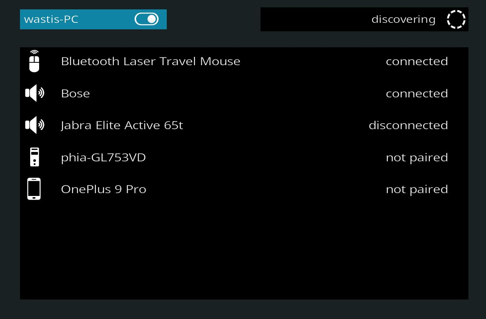

# Bluetooth Manager for Kodi

This Kodi addon provides a manager that allows to pair, connect, disconnect and remove bluetooth devices from within a linux based Kodi. This is useful for headless systems.

## Installation

This addon communicates with bluez via the dbus interface, bluez and dbus must be up and running. In case of bluetooth audio devices, the module "pulseaudio-module-bluetooth" needs to be installed.

	sudo apt install pulseaudio-module-bluetooth
	systemctl --user restart pulseaudio

An example on how to set up a headless kodi on a raspberry-pi with Bluetooth Manager and equalizer can be found [here](https://github.com/wastis/PulseEqualizerGui/wiki/Example-setup-on-Raspberry-Pi).

*2022 wastis*