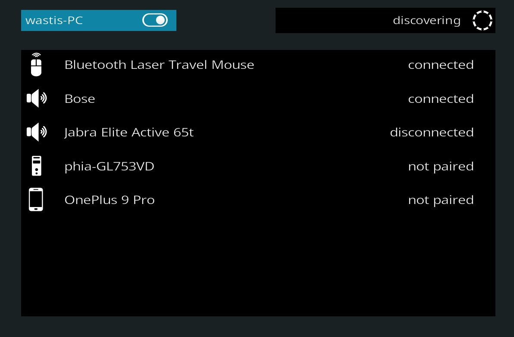

# Bluetooth Manager for Kodi

This Kodi addon provides a manager that allows to pair, connect, disconnect and remove bluetooth devices from within a Linux-based Kodi system. It is specifically optimized for headless systems and provides full support for modern Bluetooth pairing methods.

[Version 1.0.6](https://github.com/wastis/LinuxAddonRepo)

## Features

- **Expanded Pairing Support**: Full support for Secure Simple Pairing (SSP), including Passkey, PIN-based, and confirmation-based authentication.
- **Headless Optimized**: Automatic confirmation and authorization for pairing requests, ideal for systems without a display or keyboard.
- **Device Management**: Easily pair, connect, disconnect, trust, or remove Bluetooth devices.

## Installation

### System Prerequisites

This addon communicates with BlueZ via the DBus interface. Both BlueZ and DBus must be installed and running on your system.

For Bluetooth audio devices, the PulseAudio Bluetooth module is required:

    sudo apt install pulseaudio-module-bluetooth
    systemctl --user restart pulseaudio

### Installation of the Addon in Kodi

This addon is included in the [Linux Addon Repository](https://github.com/wastis/LinuxAddonRepo). It is recommended to use the repository for installation to ensure easy version upgrades.

An example of how to set up a headless Kodi on a Raspberry Pi with Bluetooth Manager and Equalizer can be found [here](https://github.com/wastis/PulseEqualizerGui/wiki/Example-setup-on-Raspberry-Pi).

## Configuration

The addon offers several configuration options in its settings menu:

- **PIN for pairing**: Set the default PIN used for legacy pairing (default: `0000`).
- **Automatically trust device**: When enabled, devices will be automatically trusted after a successful pairing (default: `true`).
- **Show unknown devices**: Toggle visibility of devices without a broadcasted name.

*2022-2026 wastis*